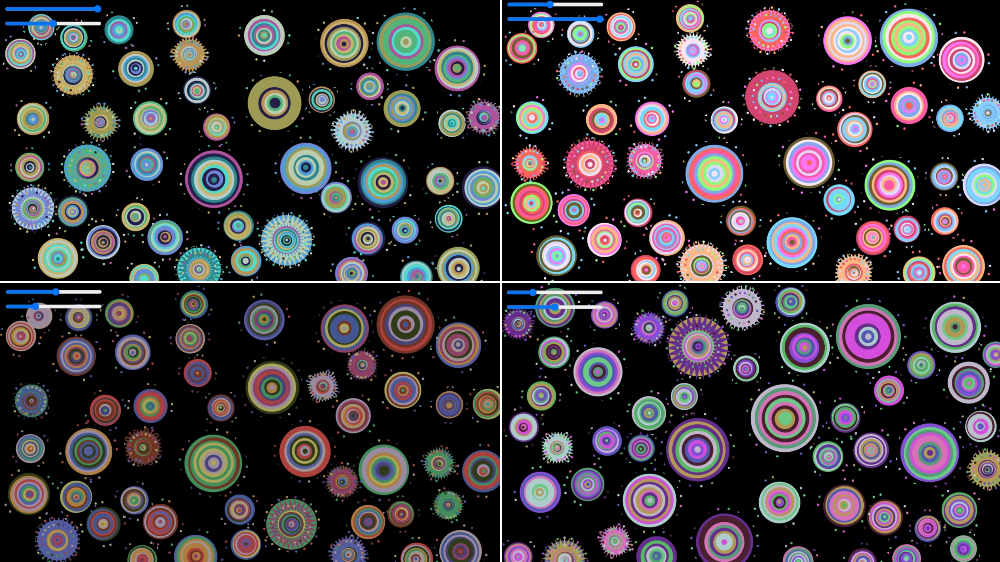

# IDEA9103 - Creative Coding Major Project - Wheels of fortune - Audio
# 9103-Carlos_C
# yzen0964_SID:550113469

---

## Introduction 
This project is a secondary creation based on our team’s Wheels of Fortune artwork. Its core animation system is driven by audio and interaction, utilizing FFT and Amplitude analysis. The project was developed using p5.js, and was inspired by Pacita Abad’s Wheels of Fortune, which was the piece originally selected by our group at the beginning of the assignment.

---

## How to Interact 
The sliders control audio volume and playback speed.
The sliders also control the hue and brightness of the animated circles.
Moving the mouse horizontally adjusts the stereo panning: circles on the left or right side will enlarge depending on which channel you’re closer to.
The pink dropdown menu at the top-left allows users to switch between multiple songs. Each time a new song is selected, the circle layout refreshes.
The play/pause button at the bottom center controls audio playback.
The transparency of the audio spectrum bars adjusts based on the volume level, while their colors are dynamically updated based on the hue and brightness sliders.
The background audio spectrum visualization uses amp analysis, and the colors are drawn from the original team project color palette.

---

## Core Techniques  

The animation is driven by a combination of audio analysis (FFT and amplitude), interactive sliders, and procedural randomness. Real-time sound features and user interactions are merged to generate continuously evolving, dynamic visuals.

## Key Modifications & Enhancements
Added multiple song selection with a dropdown to play various tracks.
Integrated an interactive control panel for adjusting hue, brightness, volume, and speed in real time.
Implemented mouse-controlled stereo panning.
Incorporated audio spectrum bar visualization synced with the live audio.
Applied dynamic scaling of circles in response to low-frequency (bass) energy, enhancing visual rhythm.
Increased the spacing buffer between circles to prevent overlapping during animations.
Used songs from Frank Ocean, Tyler the Creator, and Kendrick Lamar, reflecting personal music preferences.

## Technical Overview  
generateRandomCircles() creates non-overlapping floating circles with randomized positions and sizes.
draw() function combines:
  Center ripple wave background (animated using millis() timing).
  Audio spectrum visualization (fft.analyze()).
  Floating circle reactions driven by bass energy (getEnergy("bass")) and amplitude.
  Slider-based real-time adjustments for hue, brightness, volume, and speed.
windowResized() dynamically adapts the canvas size and repositions UI elements upon window resizing.
---

## How to Use / View  
1. **Open the HTML file** containing the embedded JavaScript code.
2. **Interact with the sliders** at the top left of the screen:  
   - Drag the **Hue Slider** to shift the colors of the floating circles around the color wheel.  
   - Drag the **Brightness Slider** to lighten or darken the colors.  
3. **Observe the circles** rotating and floating dynamically on the screen, creating an ever-changing composition inspired by Pacita Abad’s artistic style.
Use the sliders to adjust hue and brightness, transforming the color palette in real time and discovering new variations within the same visual language, an exploration of color and texture that invites the viewer to participate in the project.

Below is an example showing the effect of adjusting the sliders:

---

## Technical Notes  
- The animation runs continuously without explicit “start/stop” controls.  
- **If resizing the window**, the canvas and circles automatically adjust and re-render to fit the new size.
- **If refreshing the page**, a new arrangement of circles will be generated, offering a fresh combination of positions, shapes, and textures.
---