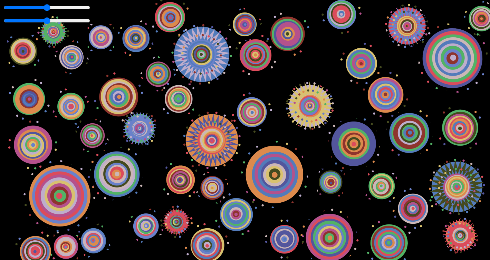
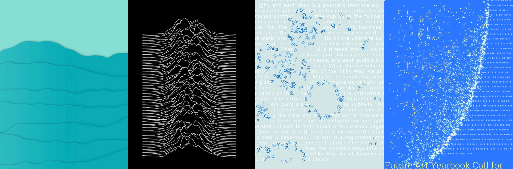
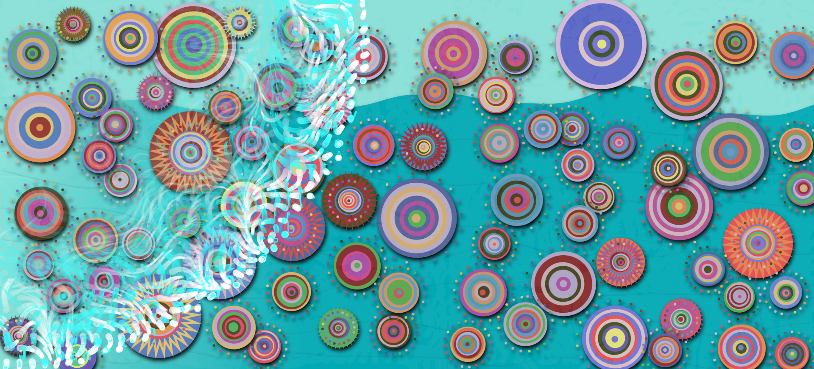

# IDEA9103 - Creative Coding Major Project
# Tut01-Carlos_C
**Name** Joy Zeng (qzen0648)  
**Individual Focus:** Perlin Noise and Randomness as Dynamic Animation Drivers

---

## 1. Project Background
This project is an interactive, dynamic visualisation, draws inspiration from Filipino artist **Pacita Abad**’s painting **Wheel of Fortune**, known for its radial composition and cultural symbolism.

Here’s a image of our final group project:
<p align="center">
  
</p>

The group prototype delivers a field of hand-drawn circles whose hue/brightness are controlled by HSB sliders, rendered in a single canvas. 
My individual task focuses on using **Perlin noise** and **random seeds** to drive a non-repetitive, emergent animation system. 
My task keeps the **non-overlapping circle logic** from group project but replaces manual sliders with **Perlin-noise modulation** and adds:

### What I kept, what I changed  
| Inherited from group code | Re-engineered in my build |
|---------------------------|---------------------------|
| Non-overlapping circle grid (collision test) | Replaced sliders with Perlin-noise colour & radius modulation |
| Circle buffers (`p5.Graphics`) for performance | Added **wave layer**, **interactive layer**, **noise-driven gradient** |
| Monolithic draw loop | Layered renderer – independent buffers composited per-frame |
| Static palette | Dynamic palette sampled from Abad’s painting, shifted by noise |

All these layers are composed each frame via independent `p5.Graphics` buffers.

---

## 2. Inspiration

- Joy Division’s *Unknown Pleasures* waveform → wave layer; 
- Blow up the sea water by Sihua → particle trails; 
- yokoego’s bubble photography → bubble deformation.

Inspiration:
<p align="center">
  
</p>


## 3. Individual Conceptual Direction

The goal of my animation is to simulate **original painting** through smooth but unpredictable motion. Rather than controlling the scene directly via UI sliders or loops, I allow noise functions to govern nearly all key variables:
- Circle radius and layer count
- Floating amplitude and rotation speed
- Particle trail emission and fade
- Edge distortion of ripples
- Gradient blending across time
This choice is intended to demonstrate how **algorithmic uncertainty** can foster richer visual dynamics.

Layered Composition (bottom → top)  
| Z-order | Layer | Generator | Dominant driver | Visual role |
|---------|-------|-----------|-----------------|-------------|
| 1 | **Blobby Wave** | 120 ± horizontal segments | `noise(xOff,yOff)` | Deep background motion |
| 2 | **Colour-Ring Layer** | 80–100 circle buffers (group code, Perlin-tuned) | `noise(t+phase)` | Rotating mid-ground motifs |
| 3 | **Particle Trails + Fading Residuals** | Dot & letter particles on an off-screen canvas | 3-D noise vector field | Mid-foreground texture |
| 4 | **Interactive Bubble Layer** | Ripples & Perlin bubbles | mouse XY + polar noise | Immediate user feedback |

All four buffers are composited each frame; only buffers with changed parameters are re-drawn.

---

## 4. Interaction Instructions

The sketch is reactive but not dependent on user input.

- **Click** – create a ripple and a blue Perlin bubble.  
- **Idle** – waves and circles evolve autonomously.  
- **Resize window** – all buffers rebuild to fit the new viewport.

---

## 5. Visual Demonstration

### Figure 1: Static screenshot  
This shows the result of layered rendering — background blobby waves, mid-layer rotating colored circles, and particle trails layer.
<p align="center">
  
</p>

### Figure 2: Animated interaction demo  
Clicking spawns blue perlin bubbles and particle trails that flow and fade.
<p align="center">
  
</p>

---

## 6. Technical Implementation 

### 6.1 Blobby Wave (background)  

```js
for (let i = height * 0.3; i < height; i += height * 0.1) {
  beginShape();
  let xoff = i / 10;                       // row offset
  vertex(0, height);  vertex(0, i);
  for (let x = 0; x < width; x += 0.1) {
    let offset = map(noise(xoff, yoff), 0, 1, -60, 60);
    vertex(x, i + offset);
    xoff += 0.0005;                        // smooth transition
  }
  vertex(width, i);  vertex(width, height);
  endShape(CLOSE);
}
yoff += 0.01;                              // temporal drift
```
Vertical displacement is sampled from 2-D Perlin noise; yoff increments each frame to create perpetual flow.

### 6.2 Colour-Ring Layer (group circles, Perlin-modulated)
1. Per-frame transform & display

```js
for (let cp of randomCirclePosition) {
  cp.angle += cp.speed * deltaTime;
  let ox = sin(t + cp.floatPhaseX) * cp.floatAmplitude;
  let oy = cos(t + cp.floatPhaseY) * cp.floatAmplitude;
  push();
  translate(cp.x + ox, cp.y + oy);
  rotate(cp.angle);
  imageMode(CENTER);
  image(cp.pg, 0, 0);
  pop();
}
```
2. Conditional buffer redraw

```js
if (needRedrawBuffers) {
  for (let cp of randomCirclePosition) {
    cp.pg.clear();  cp.pg.colorMode(HSB, 360, 100, 100);
    let n = noise(t + cp.noisePhase);
    let dynamicR = cp.r * (1 + (n - .5) * .4);
    let layers   = 10 + floor((n - .5) * 4);
    if (random(1) < 0.2)
      drawZigzagCircleOn(cp.pg, cp.pg.width/2, cp.pg.height/2, layers, dynamicR, n);
    else
      drawHandDrawnCircleOn(cp.pg, cp.pg.width/2, cp.pg.height/2, layers, dynamicR, n);
  }
  needRedrawBuffers = false;
}
```
Noise drives radius, layer count, hue shift and stroke weight; buffers redraw only when flagged, mirroring jera0420’s optimisation strategy.

### Particle Trails + Fading Residuals
Fade pass (destination-out)

```js
let ctx = waveLayer.drawingContext;
ctx.save();   ctx.globalCompositeOperation = 'destination-out';
waveLayer.noStroke();  waveLayer.fill(0, fadeAlpha);
waveLayer.rect(0, 0, width, height);
ctx.restore();  ctx.globalCompositeOperation = 'source-over';
```
Grid activation & particle spawn
```js
let baseR = (waveFrame * waveSpeed) % waveMaxR;
let tt = waveFrame * 0.005;
for (let cell of waveGrid) {
  if (!cell.dead) {
    let d = dist(cell.x, cell.y, 0, 0);
    let ang01 = (atan2(cell.y, cell.x) / TWO_PI + 1) % 1;
    let off = (noise(ang01 * 3, tt) - .5) * noiseAmp;
    if (d < baseR + off) {
      cell.dead = true;
      let n = floor(random(6, 12));
      for (let i = 0; i < n; i++) waveParticles.push(new DotParticle(cell.x, cell.y));
      let ch = chars[spawnIdx++ % chars.length];
      waveParticles.push(new LetterParticle(cell.x, cell.y, ch));
    }
  }
}
```
Particle update & render
```js
for (let i = waveParticles.length - 1; i >= 0; i--) {
  let p = waveParticles[i];  p.update();  p.show(waveLayer);
  if (p.dead) waveParticles.splice(i, 1);
}
```
Trails persist via a low-alpha erase pass; particles follow a 3-D noise flow field.

### 6.4 Interactive Bubble Layer
Ripple edge deformation
```js
beginShape();
let detail = 60;
for (let i = 0; i < detail; i++) {
  let angle = TWO_PI * i / detail;
  let noiseOffset = map(
        noise(angle * 5 + this.noiseSeed, frameCount * 0.02),
        0, 1, -10, 10);
  let xPos = this.x + (this.radius + noiseOffset) * cos(angle);
  let yPos = this.y + (this.radius + noiseOffset) * sin(angle);
  vertex(xPos, yPos);
}
endShape(CLOSE);
```
Interactive-layer maintenance
```js
interactiveLayer.drawingContext.globalCompositeOperation = 'destination-out';
interactiveLayer.fill(0, 0, 0, 15);
interactiveLayer.rect(0, 0, width, height);
interactiveLayer.drawingContext.globalCompositeOperation = 'source-over';

for (let i = perlinBubbles.length - 1; i >= 0; i--) {
  perlinBubbles[i].update();
  perlinBubbles[i].show(interactiveLayer);
  if (perlinBubbles[i].isDead()) perlinBubbles.splice(i, 1);
}
image(interactiveLayer, 0, 0);
```
Ripples and bubbles inherit contour jitter from polar-coordinate noise; the interactive buffer self-fades each frame to prevent artefact build-up.

### 6.5 Viewport-Adaptive Circle Count

```js
const numCols = ceil((windowWidth  - startX) / spacingX) + 1;
const numRows = ceil((windowHeight - startY) / spacingY) + 1;
const numCircles = numCols * numRows;
```
---

## 7 Critical Reflection & Key Modifications  

### 7.1 Noise-Based Parameter Control  
Manual sliders were replaced by a single Perlin noise field. Radius, layer count, colour, and stroke now vary together, producing continuous and unpredictable changes.

### 7.2 On-Demand Buffer Updates  
A dirty-flag system refreshes cached graphics only when visual parameters change or the window is resized, reducing unnecessary pixel work.

### 7.3 Viewport-Responsive Geometry  
The number of circles is computed from current window dimensions instead of using a fixed constant. This keeps fill density appropriate across devices and avoids wasted rendering.

### 7.4 Layer-Specific Fading  
Residual fading is applied solely to the particle layer; other layers remain sharp, preventing global blurring.

### 7.5 Noise-Perturbed Interaction  
Ripples and bubbles receive polar-coordinate noise, so each click creates a distinct outline. The interactive layer self-fades, preventing artefact build-up during extended interaction.

---