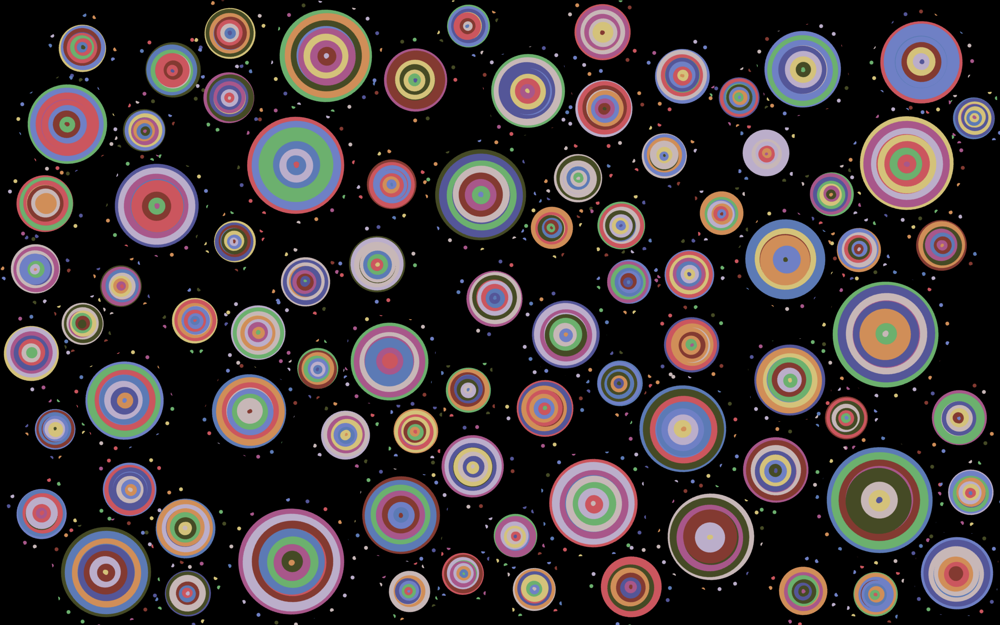

# Ripple Animation Sketch

This is a generative animation project created using [p5.js](https://p5js.org/), inspired by the natural phenomenon of ripple diffusion and the visual sketch *Rainbow Ripples* by Richard Bourne.

The initial visual concept was developed by our group based on an interpretation of Audrey Flack’s painting *Wheel of Fortune*. We extracted the vivid colors and dynamic circular motifs to generate expressive visual patterns.

Building on the group's static sketch (Sketch9), I created this time-based and interactive animation. It continuously generates expanding concentric rings that rotate and fade out rhythmically. Clicking anywhere on the canvas allows users to skip the delay and immediately trigger the next ripple, adding interactivity and control to the generative system.

## Features

- Concentric rings with hand-drawn jitter effects
- Infinite loop: each ripple continuously emits new rings
- Random colors sampled from *Wheel of Fortune*
- Smooth expansion and fading over time
- Mouse click skips delay to trigger next ripple layer
- Randomized positions and independent rotation per ripple
- Screen resizes dynamically regenerate ripple layout

## Interaction Instructions

- Load the page to start the animation automatically
- Click anywhere to reveal the next ripple earlier
- Resize the window to regenerate the layout responsively

## My Individual Approach

- **Animation Drivers**: I chose **time and interaction**
- **Animation Focus**: My sketch emphasizes temporal rhythm and click-based intervention
- **Difference from Teammates**: While others focused on component masking, layer blending, or Perlin noise motion, my implementation centers on sequential time delays and interaction-controlled ripple expansion

## Technical Summary

- Animation is managed through an ES6 JavaScript `class` (`Ripple`)
- Each ripple object maintains its own appearance time and assigned color
- Uses `millis()` to calculate elapsed time and control the animation sequence
- Mouse interaction uses a custom `skipToNextLayer()` method to accelerate upcoming ripple generation

## External Inspirations

- Painting: *Wheel of Fortune* by Audrey Flack – palette and circular motif source
- Sketch: ["Rainbow Ripples" by Richard Bourne](https://openprocessing.org/sketch/1986824)  
  License: [CC BY-NC-SA 3.0](https://creativecommons.org/licenses/by-nc-sa/3.0/)  
  Referenced for ripple structure and multi-layered wave dynamics

## File Structure

- `index.html` – HTML entry point
- `time.js` – Main p5.js sketch and ripple logic
- `assets/ripples.png` – Animation screenshot
- `README.md` – This documentation file

## Acknowledgements

- Visual concept inspired by group analysis of *Wheel of Fortune* by Audrey Flack
- Ripple rhythm and loop logic referenced from *Rainbow Ripples* by Richard Bourne on OpenProcessing