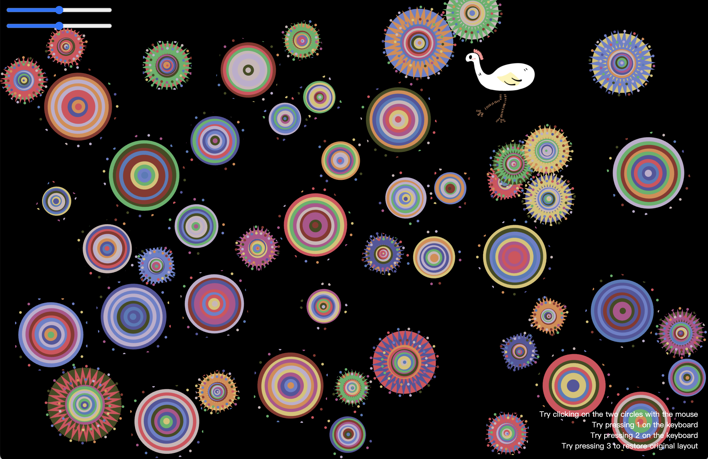

# IDEA9103 - Creative Coding Major Project_QiFang_User Input
# 9103-Carlos_C

---

## Project Title  
**Interactive Floating Circle Composition Inspired by Pacita Abad’s *Wheels of Fortune***

---

## User Input Description  
Based on the group layout, I added a couple of interactive features:

1. when the mouse clicks on two circles, the two circles merge and become a new circle.

2. a little bird pattern follows the mouse.

3. when the bird pattern is close to the circle, the circle avoids the bird pattern.

4. Press keyboard 1 and the size of the circle on the screen will change randomly.

5. Press keyboard 2, the color of the disc on the screen will change randomly.

6. Press keyboard 3, the screen will be restored to its initial state.

---

## Reference  
- **https://p5js.org/reference/p5/mousePressed/:** Code reference for clicking on two circles and then generating a new circle.
- **https://p5js.org/reference/p5.Element/mousePressed/:** Code reference for clicking on two circles and then generating a new circle.
- **https://openprocessing.org/sketch/2615691:** Code reference for clicking on two circles and then generating a new circle.
- **https://natureofcode.com/forces/:** Circle to avoid following the mouse to move the bird pattern code reference.
- **https://editor.p5js.org/awcuny/sketches:** Circle to avoid following the mouse to move the bird pattern code reference, check mouse in circle.
- **https://p5js.org/tutorials/responding-to-inputs/:** Code reference for restoring the screen to its initial state by pressing the keypad.
- **https://p5js.org/examples/classes-and-objects-connected-particles/:** Code reference for restoring the screen to its initial state by pressing the keypad.