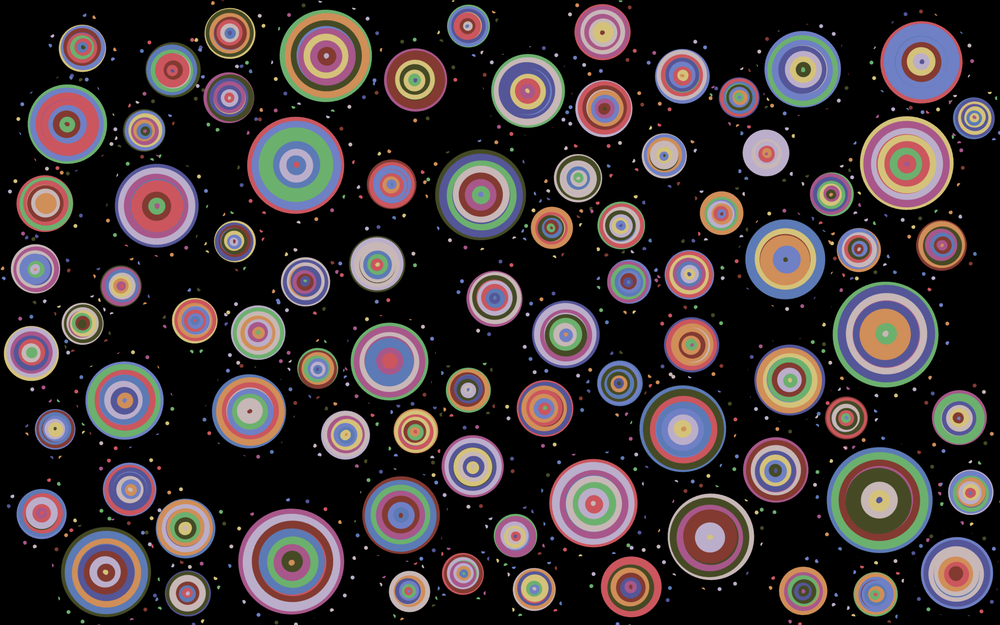

# Ripple Time-base Animation 

This is a generative animation project built with p5.js, 
inspired by the natural behavior of ripples spreading across water,
as well as the visual work Rainbow Ripples by Richard Bourne.

The core visual style was originally developed as part of a group exploration based on Wheel of Fortune, 
a painting by Audrey Flack. Our team extracted its vibrant colors and energetic circular motifs to generate expressive static patterns (Sketch9).

Building on that foundation, I transformed the group’s static composition into a time-based and interactive animation. The final version simulates expanding concentric waves that rotate, grow, and fade out over time. Clicking the screen allows users to skip the delay and instantly trigger the next ripple, adding a sense of interactivity and generative rhythm.

## Features

- Dynamic ripple rings drawn with hand-drawn visual variation
- Infinite animation loop: each ripple continuously emits new rings
- Random color palette extracted from the painting *Wheel of Fortune*
- Each ring expands smoothly over time and fades out after a duration
- Clicking the mouse will skip the delay and immediately trigger the next ripple ring
- All ripple instances rotate individually and appear randomly across the screen
- Screen-responsive: resizing the window regenerates and redraws ripples

## Technologies Used

- [p5.js](https://p5js.org/) for canvas drawing and animation
- JavaScript ES6 class syntax for ripple behavior

## File Structure

- `index.html`: Entry file that loads p5.js and runs the sketch  
- `time.js`: Main animation logic and Ripple class definition  
- `README.md`: Project description and usage instructions

## How to Use

1. Open `index.html` in a modern browser that supports JavaScript.
2. Enjoy the ripple animations.
3. Click the mouse to trigger the next ripple in each group earlier.
4. Resize the window to generate a new ripple arrangement.

## Credits

- Color palette inspired by the painting *Wheel of Fortune* by Audrey Flack.  
- Visual effect inspired by “[Rainbow Ripples](https://openprocessing.org/sketch/1986824)” by Richard Bourne  
  Licensed under Creative Commons Attribution NonCommercial ShareAlike  
  https://creativecommons.org/licenses/by-nc-sa/3.0
